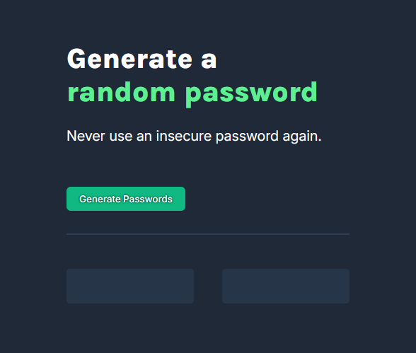

# Password Generator (SCRIMBA Project)

A simple, responsive web app to generate secure random passwords. Built as part of a SCRIMBA course project.

## Features
- Generates two random passwords at the click of a button
- Uses uppercase, lowercase, numbers, and special characters
- Clean, modern UI with responsive design
- No dependencies or build tools required

## Usage
1. Clone or download this repository.
2. Open `index.html` in your web browser.
3. Click the "Generate Passwords" button to create two new random passwords.

## Project Structure
- `index.html` – Main HTML file, contains the UI structure
- `index.css` – Styles for the app
- `index.js` – JavaScript logic for password generation and DOM updates

## How it works
- The password generator uses a character set of letters, numbers, and symbols.
- When the button is clicked, two independent random passwords are generated and displayed.
- All logic is handled in vanilla JavaScript for simplicity and learning purposes.

## Customization
- To change password length, adjust the loop count in `index.js`.
- To modify the character set, edit the `characters` array in `index.js`.
- To change the look and feel, edit `index.css`.

## Screenshot

## License
MIT

---
This project was created as part of the SCRIMBA Frontend Developer Career Path.
